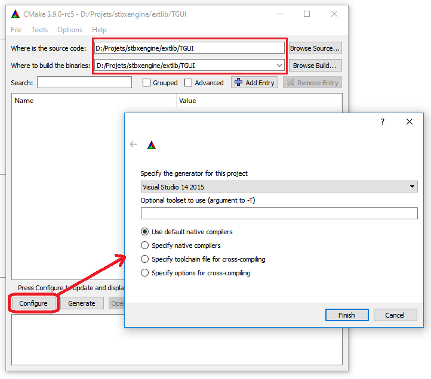
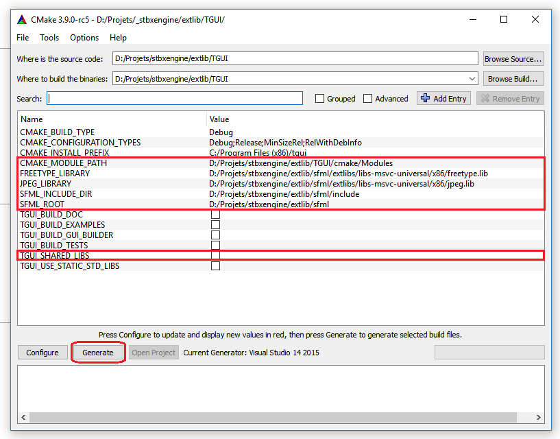

## Set up your environment (Build yourself)

First of all, you must grab the latest sources from the bitbucket repository and build them by yourself!\n
Don't worry, this step is usually easy if you already have all the Prerequisites setup.\n
To do so, open your command prompt and clone the repository:\n

    git clone https://bitbucket.org/stalker2106/StbxEngine.git

Then you want to download the latest source of all the dependencies\n

    git submodule update --init --recursive

You should already have all the mandatory code to start developing your game; though, before\n
using it, you must build the library and its dependencies.

### Build SFML

You need to build SFML to link TGUI with it. The git repository is linked to the Stbx one and should\n
have grabbed the latest version of SFML inside "<REPO>/extlib/SFML/" directory.

SFML has a very good tutorial about how to setup and build the library that you can follow [here](https://www.sfml-dev.org/tutorials/2.4/compile-with-cmake.php)

NOTE: Check carefully the type of the built binary, you need to build STATIC SFML in order to link it with StbxEngine.
      (Depending on your project state, you may choose Release over Debug in parameters)\n

Once its done: Hoorah, you got SFML setted up. Now let's build the TGUI component.

### Build TGUI

You need to build Texu's GUI in order to compile StbxEngine. The git repository is linked and should\n
have grabbed the latest version of TGUI inside "<REPO>/extlib/TGUI/" directory.

Start configuring TGUI by navigating through the repository to "<REPO>/extlib/TGUI/", and run\n
cmake-gui within it.\n
You should have the same path in the two input boxes on top of the dialog, append "/build/" to the build path to keep your directory clean.\n
When you have selected the right pathes, click configure button (highlighted in red on the picture), then choose the appropriate compiler.\n

When done, you should have all the values in the main frame highlighted in RED.\n
Then, fill in the surrounded fields with the correct values (like shown on picture).\n
Once done, you can click generate button to get you project/Makefile, and start building right away.
NOTE: Check carefully the type of the built binary, you need to UNCHECK the build shared checkbox
      (you probably want to select Release over Debug for configuration type for most cases)\n

When done, time to build StbxEngine in bones and flesh !\n

### Build StbxEngine

Get back to the root folder of the repository, and run CMake. Again, check carefully your options to match your environment.\n
NOTE: For Visual Studio, use the given Solution in <REPO>/vs/ which is Visual Studio 14 2015 (or later) compatible.\n

    cd ../../
    cmake .

Then just run the Makefile or the Visual Studio solution, and the project should build without errors.\n
Once done, you can use the engine to create your own game, following the next section guide.\n